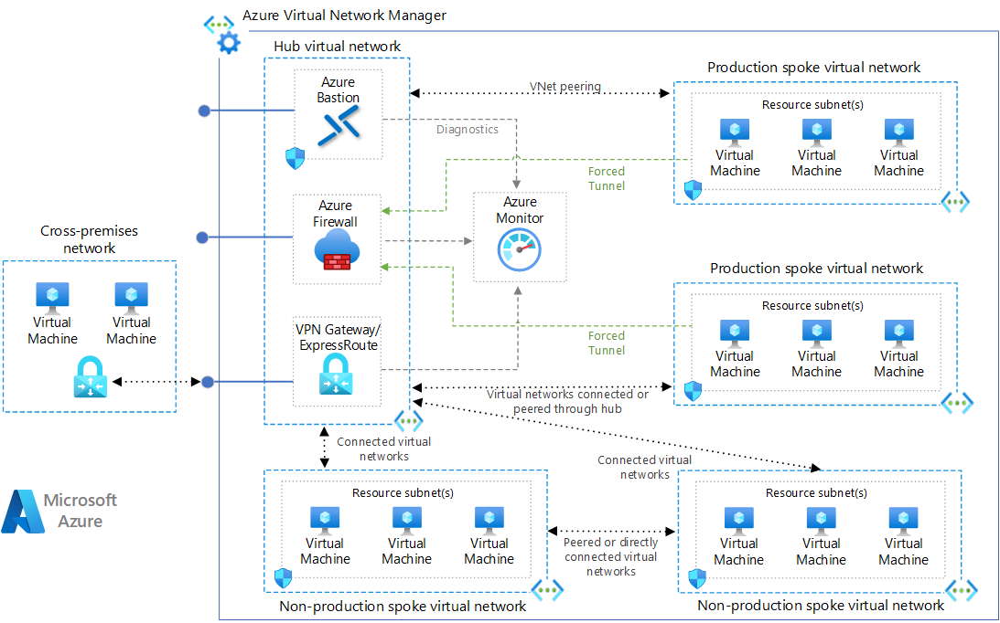

# AZ-NOR-SECURE-HUB-SPOKE

<div align="center">


**Architecture Hub-and-Spoke sécurisée avec inspection de flux centralisée**

*Version 2.0 - Migration Bicep → Terraform*

[Architecture](#-architecture) • [Composants](#-composants) • [Déploiement](#-déploiement) • [Sécurité](#-sécurité)


</div>

---

## Table des matières

- [Vue d'ensemble](#-vue-densemble)
- [Avantages stratégiques](#-avantages-stratégiques)
- [Architecture](#-architecture)
- [Composants](#-composants)
- [Segmentation réseau](#-segmentation-réseau)
- [Structure du projet](#-structure-du-projet)
- [Code source Terraform](#-code-source-terraform)
  - [main.tf](#-maintf)
  - [network.tf](#-networktf)
  - [variables.tf](#-variablestf)
  - [outputs.tf](#-outputstf)
  - [terraform.tfvars.example](#-terraformtfvarsexample)
- [Prérequis](#-prérequis)
- [Déploiement](#-déploiement)
- [Sécurité](#-sécurité)
- [Monitoring](#-monitoring)
- [Bonnes pratiques](#-bonnes-pratiques)
- [Dépannage](#-dépannage)
- [FAQ](#-faq)
- [Coûts estimés](#-coûts-estimés)
- [Évolutions futures](#-évolutions-futures)

---

## Vue d'ensemble

Ce projet implémente une architecture réseau **Hub-and-Spoke** sécurisée sur Microsoft Azure, déployée via **Terraform**, conçue pour la région **Norway East**. L'architecture garantit une inspection centralisée de tout le trafic réseau via Azure Firewall, une segmentation claire entre les environnements de production et non-production, et un monitoring complet des flux réseau.

### Caractéristiques principales

- **Inspection centralisée** : Tout le trafic passe par Azure Firewall
- **Segmentation réseau** : Isolation complète entre Production et Non-Production
- **Monitoring intégré** : Log Analytics Workspace pour l'analyse des logs de sécurité
- **Accès sécurisé** : Azure Bastion pour l'accès aux machines virtuelles
- **Routage forcé** : User Defined Routes (UDR) pour garantir le passage par le Firewall
- **Peering bidirectionnel** : Communication sécurisée entre Hub et Spokes
- **Infrastructure as Code** : Entièrement déployable et reproductible via Terraform

---

## Avantages stratégiques

### 1. Sécurité Périmétrique et Inspection Centrale

L'avantage majeur est l'utilisation d'un **Azure Firewall au centre du réseau** (le "Hub").

- **Inspection des flux** : Chaque paquet entre Production (`192.168.x.x`) et Non-Production (`172.16.x.x`) est analysé.
- **Blocage par défaut** : Politique **"Zero Trust"** — rien ne passe sans règle explicite.

### 2. Isolation Stricte des Environnements

Grâce aux plages IP distinctes et aux VNets séparés :

- **Étanchéité** : Une erreur en Non-Prod ne peut pas contaminer la Production.
- **Standardisation** : Adressage `192.168.x.x` / `172.16.x.x` pour un inventaire clair.

### 3. Maîtrise Totale du Trafic (UDR)

- **Anti-Exfiltration** : Tout transit vers Internet passe obligatoirement par le Firewall.

### 4. Auditabilité et Conformité (Log Analytics)

- **Preuve de conformité** : Preuves exploitables pour ISO 27001, RGPD et SOC 2.

### 5. Réduction de la Surface d'Attaque (Bastion)

- **Accès sécurisé** : Connexion SSL via le portail Azure, sans exposer d'IP publiques sur les VMs.

### Résumé des avantages

| Avantage | Impact Métier |
|----------|---------------|
| **Centralisation** | Gestion simplifiée de la sécurité sur un seul point (le Hub) |
| **Évolutivité** | Ajout d'un nouveau Spoke sans redéployer le Hub |
| **Gouvernance** | Visibilité totale sur les coûts et les flux |
| **Reproductibilité** | Déploiement identique en quelques commandes via Terraform |

---

## Architecture

### Topologie réseau

```
                          ┌─────────────────────────────────────┐
                          │           Hub VNet (Core)            │
                          │           10.0.0.0/16                │
                          │                                      │
                          │  ┌──────────────┐  ┌─────────────┐  │
                          │  │ Azure        │  │ Azure       │  │
                          │  │ Firewall     │  │ Bastion     │  │
                          │  │ 10.0.1.0/24  │  │ 10.0.2.0/24│  │
                          │  │ (fw-hub-     │  │ (bastion-   │  │
                          │  │  central)    │  │  hub)       │  │
                          │  └──────┬───────┘  └─────────────┘  │
                          └─────────┼───────────────────────────┘
                 VNet Peering       │        VNet Peering
          ┌────────────────────────┤────────────────────────┐
          │                        │                        │
          ▼                        │                        ▼
┌─────────────────────┐            │           ┌─────────────────────┐
│  Spoke Production   │            │           │ Spoke Non-Production │
│  192.168.0.0/16     │            │           │ 172.16.0.0/12        │
│                     │            │           │                      │
│  ┌───────────────┐  │            │           │  ┌───────────────┐   │
│  │ vm-prod-01    │  │  ◄── All traffic ──►   │  │ vm-nonprod-01 │   │
│  │ 192.168.1.0/24│  │   inspected by FW      │  │ 172.16.1.0/24 │   │
│  └───────────────┘  │                        │  └───────────────┘   │
│  UDR → 10.0.1.4     │                        │  UDR → 10.0.1.4      │
└─────────────────────┘                        └──────────────────────┘
```

L'architecture se compose de trois réseaux virtuels interconnectés via des **VNet Peerings bidirectionnels**, avec tout le trafic inter-spoke forcé à transiter par l'Azure Firewall grâce aux **UDR**.

---

## Composants

### 1. **Hub VNet** (`vnet-hub-core`)
- **Adresse IP** : `10.0.0.0/16`
- **Subnets** : `AzureFirewallSubnet` (`10.0.1.0/24`) · `AzureBastionSubnet` (`10.0.2.0/24`)

### 2. **Spoke Production** (`vnet-spoke-prod`)
- **Adresse IP** : `192.168.0.0/16`
- **Subnets** : `snet-prod-resources` (`192.168.1.0/24`)

### 3. **Spoke Non-Production** (`vnet-spoke-nonprod`)
- **Adresse IP** : `172.16.0.0/12`
- **Subnets** : `snet-nonprod-resources` (`172.16.1.0/24`)

### 4. **Azure Firewall** (`fw-hub-central`)
- **Tier** : Standard · **IP Privée** : `10.0.1.4`
- **Politique** : `fw-policy-global` avec règles Allow inter-spoke

### 5. **Azure Bastion** (`bastion-hub`)
- Accès sécurisé aux VMs sans exposer d'IP publiques

### 6. **Log Analytics Workspace** (`law-hub-norway`)
- **Rétention** : 30 jours · **SKU** : PerGB2018

### 7. **Machines Virtuelles**
- `vm-prod-01` et `vm-nonprod-01` - Ubuntu 20.04 LTS, Standard_B1s

### 8. **Route Table UDR** (`rt-forced-to-firewall`)
- Force `0.0.0.0/0` vers le Firewall (`10.0.1.4`)

---

## Segmentation réseau

| Environnement | Plage d'adresses | Description |
|--------------|------------------|-------------|
| **Hub** | `10.0.0.0/16` | Services partagés (Firewall, Bastion) |
| **Production** | `192.168.0.0/16` | Environnement de production isolé |
| **Non-Production** | `172.16.0.0/12` | Environnement de développement/test |

### Règles Firewall

| Règle | Source | Destination | Protocole | Action |
|-------|--------|-------------|-----------|--------|
| Allow-Spoke-to-Spoke | `192.168.0.0/16` `172.16.0.0/12` | `192.168.0.0/16` `172.16.0.0/12` | ICMP, TCP, UDP | ✅ Allow |

---

## Structure du projet

```
az-nor-secure-hub-spoke/
├── main.tf                   # Ressources principales (Firewall, Bastion, VMs, UDR, Logs)
├── network.tf                # VNets, Subnets, VNet Peerings
├── variables.tf              # Déclaration de toutes les variables
├── outputs.tf                # Sorties utiles post-déploiement
├── terraform.tfvars.example  # Modèle de fichier de variables (à copier)
├── .gitignore                # Exclut les fichiers sensibles (tfstate, tfvars)
└── README.md                 # Ce fichier
```

---

## Code source Terraform

### `main.tf`

Ressources principales : Firewall, Bastion, Log Analytics, UDR, Machines Virtuelles et paramètres de diagnostic.

```hcl
###############################################################################
# AZ-NOR-SECURE-HUB-SPOKE - main.tf
# Ressources principales : Firewall, Bastion, VMs, Log Analytics, UDR
###############################################################################

terraform {
  required_version = ">= 1.5.0"

  required_providers {
    azurerm = {
      source  = "hashicorp/azurerm"
      version = "~> 3.100"
    }
  }
}

provider "azurerm" {
  features {}
}

# ─── Resource Group ───────────────────────────────────────────────────────────

resource "azurerm_resource_group" "main" {
  name     = var.resource_group_name
  location = var.location
  tags     = var.tags
}

# ─── Log Analytics Workspace ──────────────────────────────────────────────────

resource "azurerm_log_analytics_workspace" "main" {
  name                = "law-hub-norway"
  location            = azurerm_resource_group.main.location
  resource_group_name = azurerm_resource_group.main.name
  sku                 = "PerGB2018"
  retention_in_days   = 30
  tags                = var.tags
}

# ─── Azure Firewall Policy ────────────────────────────────────────────────────

resource "azurerm_firewall_policy" "main" {
  name                = "fw-policy-global"
  resource_group_name = azurerm_resource_group.main.name
  location            = azurerm_resource_group.main.location
  sku                 = "Standard"
  tags                = var.tags
}

resource "azurerm_firewall_policy_rule_collection_group" "main" {
  name               = "rcg-internal-traffic"
  firewall_policy_id = azurerm_firewall_policy.main.id
  priority           = 100

  network_rule_collection {
    name     = "Allow-Internal-Traffic"
    priority = 100
    action   = "Allow"

    rule {
      name                  = "Allow-Spoke-to-Spoke"
      protocols             = ["ICMP", "TCP", "UDP"]
      source_addresses      = [var.prod_address_space, var.nonprod_address_space]
      destination_addresses = [var.prod_address_space, var.nonprod_address_space]
      destination_ports     = ["*"]
    }
  }
}

# ─── Public IP - Azure Firewall ───────────────────────────────────────────────

resource "azurerm_public_ip" "firewall" {
  name                = "pip-fw-hub-central"
  resource_group_name = azurerm_resource_group.main.name
  location            = azurerm_resource_group.main.location
  allocation_method   = "Static"
  sku                 = "Standard"
  tags                = var.tags
}

# ─── Azure Firewall ───────────────────────────────────────────────────────────

resource "azurerm_firewall" "main" {
  name                = "fw-hub-central"
  resource_group_name = azurerm_resource_group.main.name
  location            = azurerm_resource_group.main.location
  sku_name            = "AZFW_VNet"
  sku_tier            = "Standard"
  firewall_policy_id  = azurerm_firewall_policy.main.id
  tags                = var.tags

  ip_configuration {
    name                 = "ipconfig-fw"
    subnet_id            = azurerm_subnet.firewall.id
    public_ip_address_id = azurerm_public_ip.firewall.id
  }
}

# ─── Diagnostic Settings - Azure Firewall → Log Analytics ─────────────────────

resource "azurerm_monitor_diagnostic_setting" "firewall" {
  name                       = "diag-fw-hub-central"
  target_resource_id         = azurerm_firewall.main.id
  log_analytics_workspace_id = azurerm_log_analytics_workspace.main.id

  enabled_log {
    category = "AzureFirewallNetworkRule"
  }

  enabled_log {
    category = "AzureFirewallApplicationRule"
  }

  metric {
    category = "AllMetrics"
  }
}

# ─── Public IP - Azure Bastion ────────────────────────────────────────────────

resource "azurerm_public_ip" "bastion" {
  name                = "pip-bastion-hub"
  resource_group_name = azurerm_resource_group.main.name
  location            = azurerm_resource_group.main.location
  allocation_method   = "Static"
  sku                 = "Standard"
  tags                = var.tags
}

# ─── Azure Bastion ────────────────────────────────────────────────────────────

resource "azurerm_bastion_host" "main" {
  name                = "bastion-hub"
  resource_group_name = azurerm_resource_group.main.name
  location            = azurerm_resource_group.main.location
  sku                 = "Standard"
  tags                = var.tags

  ip_configuration {
    name                 = "ipconfig-bastion"
    subnet_id            = azurerm_subnet.bastion.id
    public_ip_address_id = azurerm_public_ip.bastion.id
  }
}

# ─── Route Table (UDR) - Force traffic through Firewall ───────────────────────

resource "azurerm_route_table" "forced_firewall" {
  name                          = "rt-forced-to-firewall"
  resource_group_name           = azurerm_resource_group.main.name
  location                      = azurerm_resource_group.main.location
  disable_bgp_route_propagation = true
  tags                          = var.tags

  route {
    name                   = "route-to-firewall"
    address_prefix         = "0.0.0.0/0"
    next_hop_type          = "VirtualAppliance"
    next_hop_in_ip_address = var.firewall_private_ip
  }
}

resource "azurerm_subnet_route_table_association" "prod" {
  subnet_id      = azurerm_subnet.prod_resources.id
  route_table_id = azurerm_route_table.forced_firewall.id
}

resource "azurerm_subnet_route_table_association" "nonprod" {
  subnet_id      = azurerm_subnet.nonprod_resources.id
  route_table_id = azurerm_route_table.forced_firewall.id
}

# ─── Network Interface - VM Production ───────────────────────────────────────

resource "azurerm_network_interface" "prod" {
  name                = "nic-vm-prod-01"
  resource_group_name = azurerm_resource_group.main.name
  location            = azurerm_resource_group.main.location
  tags                = var.tags

  ip_configuration {
    name                          = "ipconfig-prod"
    subnet_id                     = azurerm_subnet.prod_resources.id
    private_ip_address_allocation = "Dynamic"
  }
}

# ─── Virtual Machine - Production ─────────────────────────────────────────────

resource "azurerm_linux_virtual_machine" "prod" {
  name                            = "vm-prod-01"
  resource_group_name             = azurerm_resource_group.main.name
  location                        = azurerm_resource_group.main.location
  size                            = var.vm_size
  admin_username                  = var.admin_username
  admin_password                  = var.admin_password
  disable_password_authentication = false
  network_interface_ids           = [azurerm_network_interface.prod.id]
  tags                            = var.tags

  os_disk {
    caching              = "ReadWrite"
    storage_account_type = "Standard_LRS"
  }

  source_image_reference {
    publisher = "Canonical"
    offer     = "0001-com-ubuntu-server-focal"
    sku       = "20_04-lts"
    version   = "latest"
  }
}

# ─── Network Interface - VM Non-Production ───────────────────────────────────

resource "azurerm_network_interface" "nonprod" {
  name                = "nic-vm-nonprod-01"
  resource_group_name = azurerm_resource_group.main.name
  location            = azurerm_resource_group.main.location
  tags                = var.tags

  ip_configuration {
    name                          = "ipconfig-nonprod"
    subnet_id                     = azurerm_subnet.nonprod_resources.id
    private_ip_address_allocation = "Dynamic"
  }
}

# ─── Virtual Machine - Non-Production ─────────────────────────────────────────

resource "azurerm_linux_virtual_machine" "nonprod" {
  name                            = "vm-nonprod-01"
  resource_group_name             = azurerm_resource_group.main.name
  location                        = azurerm_resource_group.main.location
  size                            = var.vm_size
  admin_username                  = var.admin_username
  admin_password                  = var.admin_password
  disable_password_authentication = false
  network_interface_ids           = [azurerm_network_interface.nonprod.id]
  tags                            = var.tags

  os_disk {
    caching              = "ReadWrite"
    storage_account_type = "Standard_LRS"
  }

  source_image_reference {
    publisher = "Canonical"
    offer     = "0001-com-ubuntu-server-focal"
    sku       = "20_04-lts"
    version   = "latest"
  }
}
```

---

###  `network.tf`

VNets, Subnets et VNet Peerings bidirectionnels entre le Hub et les deux Spokes.

```hcl
###############################################################################
# AZ-NOR-SECURE-HUB-SPOKE — network.tf
# VNets, Subnets et VNet Peerings bidirectionnels
###############################################################################

# ─── Hub VNet ─────────────────────────────────────────────────────────────────

resource "azurerm_virtual_network" "hub" {
  name                = "vnet-hub-core"
  resource_group_name = azurerm_resource_group.main.name
  location            = azurerm_resource_group.main.location
  address_space       = [var.hub_address_space]
  tags                = var.tags
}

resource "azurerm_subnet" "firewall" {
  # Ce nom est imposé par Azure — ne pas modifier
  name                 = "AzureFirewallSubnet"
  resource_group_name  = azurerm_resource_group.main.name
  virtual_network_name = azurerm_virtual_network.hub.name
  address_prefixes     = [var.hub_firewall_subnet]
}

resource "azurerm_subnet" "bastion" {
  # Ce nom est imposé par Azure — ne pas modifier
  name                 = "AzureBastionSubnet"
  resource_group_name  = azurerm_resource_group.main.name
  virtual_network_name = azurerm_virtual_network.hub.name
  address_prefixes     = [var.hub_bastion_subnet]
}

# ─── Spoke Production VNet ────────────────────────────────────────────────────

resource "azurerm_virtual_network" "prod" {
  name                = "vnet-spoke-prod"
  resource_group_name = azurerm_resource_group.main.name
  location            = azurerm_resource_group.main.location
  address_space       = [var.prod_address_space]
  tags                = var.tags
}

resource "azurerm_subnet" "prod_resources" {
  name                 = "snet-prod-resources"
  resource_group_name  = azurerm_resource_group.main.name
  virtual_network_name = azurerm_virtual_network.prod.name
  address_prefixes     = [var.prod_subnet]
}

# ─── Spoke Non-Production VNet ────────────────────────────────────────────────

resource "azurerm_virtual_network" "nonprod" {
  name                = "vnet-spoke-nonprod"
  resource_group_name = azurerm_resource_group.main.name
  location            = azurerm_resource_group.main.location
  address_space       = [var.nonprod_address_space]
  tags                = var.tags
}

resource "azurerm_subnet" "nonprod_resources" {
  name                 = "snet-nonprod-resources"
  resource_group_name  = azurerm_resource_group.main.name
  virtual_network_name = azurerm_virtual_network.nonprod.name
  address_prefixes     = [var.nonprod_subnet]
}

# ─── VNet Peering : Hub ↔ Prod ────────────────────────────────────────────────

resource "azurerm_virtual_network_peering" "hub_to_prod" {
  name                         = "peer-hub-to-prod"
  resource_group_name          = azurerm_resource_group.main.name
  virtual_network_name         = azurerm_virtual_network.hub.name
  remote_virtual_network_id    = azurerm_virtual_network.prod.id
  allow_virtual_network_access = true
  allow_forwarded_traffic      = true
  allow_gateway_transit        = false
  use_remote_gateways          = false
}

resource "azurerm_virtual_network_peering" "prod_to_hub" {
  name                         = "peer-prod-to-hub"
  resource_group_name          = azurerm_resource_group.main.name
  virtual_network_name         = azurerm_virtual_network.prod.name
  remote_virtual_network_id    = azurerm_virtual_network.hub.id
  allow_virtual_network_access = true
  allow_forwarded_traffic      = true
  allow_gateway_transit        = false
  use_remote_gateways          = false
}

# ─── VNet Peering : Hub ↔ Non-Prod ───────────────────────────────────────────

resource "azurerm_virtual_network_peering" "hub_to_nonprod" {
  name                         = "peer-hub-to-nonprod"
  resource_group_name          = azurerm_resource_group.main.name
  virtual_network_name         = azurerm_virtual_network.hub.name
  remote_virtual_network_id    = azurerm_virtual_network.nonprod.id
  allow_virtual_network_access = true
  allow_forwarded_traffic      = true
  allow_gateway_transit        = false
  use_remote_gateways          = false
}

resource "azurerm_virtual_network_peering" "nonprod_to_hub" {
  name                         = "peer-nonprod-to-hub"
  resource_group_name          = azurerm_resource_group.main.name
  virtual_network_name         = azurerm_virtual_network.nonprod.name
  remote_virtual_network_id    = azurerm_virtual_network.hub.id
  allow_virtual_network_access = true
  allow_forwarded_traffic      = true
  allow_gateway_transit        = false
  use_remote_gateways          = false
}
```

---

###  `variables.tf`

Déclaration de toutes les variables utilisées par le projet, avec valeurs par défaut.

```hcl
###############################################################################
# AZ-NOR-SECURE-HUB-SPOKE - variables.tf
###############################################################################

# ─── Général ──────────────────────────────────────────────────────────────────

variable "resource_group_name" {
  description = "Nom du groupe de ressources Azure"
  type        = string
  default     = "RG-ARCHITECTURE-COMPLET-NORWAY"
}

variable "location" {
  description = "Région Azure de déploiement"
  type        = string
  default     = "norwayeast"
}

variable "tags" {
  description = "Tags appliqués à toutes les ressources"
  type        = map(string)
  default = {
    Project     = "AZ-NOR-SECURE-HUB-SPOKE"
    Environment = "HubSpoke"
    ManagedBy   = "Terraform"
    Region      = "NorwayEast"
  }
}

# ─── Réseau - Espaces d'adressage ─────────────────────────────────────────────

variable "hub_address_space" {
  description = "Espace d'adressage du Hub VNet"
  type        = string
  default     = "10.0.0.0/16"
}

variable "hub_firewall_subnet" {
  description = "Subnet pour Azure Firewall (doit s'appeler AzureFirewallSubnet)"
  type        = string
  default     = "10.0.1.0/24"
}

variable "hub_bastion_subnet" {
  description = "Subnet pour Azure Bastion (doit s'appeler AzureBastionSubnet)"
  type        = string
  default     = "10.0.2.0/24"
}

variable "prod_address_space" {
  description = "Espace d'adressage du Spoke Production"
  type        = string
  default     = "192.168.0.0/16"
}

variable "prod_subnet" {
  description = "Subnet des ressources de production"
  type        = string
  default     = "192.168.1.0/24"
}

variable "nonprod_address_space" {
  description = "Espace d'adressage du Spoke Non-Production"
  type        = string
  default     = "172.16.0.0/12"
}

variable "nonprod_subnet" {
  description = "Subnet des ressources non-production"
  type        = string
  default     = "172.16.1.0/24"
}

variable "firewall_private_ip" {
  description = "Adresse IP privée statique du Azure Firewall"
  type        = string
  default     = "10.0.1.4"
}

# ─── Machines Virtuelles ──────────────────────────────────────────────────────

variable "vm_size" {
  description = "Taille des machines virtuelles"
  type        = string
  default     = "Standard_B1s"
}

variable "admin_username" {
  description = "Nom d'utilisateur administrateur des VMs"
  type        = string
  default     = "azureadmin"
}

variable "admin_password" {
  description = "Mot de passe administrateur des VMs (sensible)"
  type        = string
  sensitive   = true
}
```

---

###  `outputs.tf`

Sorties disponibles après le déploiement pour récupérer les informations clés.

```hcl
###############################################################################
# AZ-NOR-SECURE-HUB-SPOKE - outputs.tf
###############################################################################

output "resource_group_name" {
  description = "Nom du groupe de ressources"
  value       = azurerm_resource_group.main.name
}

output "hub_vnet_id" {
  description = "ID du Hub VNet"
  value       = azurerm_virtual_network.hub.id
}

output "prod_vnet_id" {
  description = "ID du Spoke Production VNet"
  value       = azurerm_virtual_network.prod.id
}

output "nonprod_vnet_id" {
  description = "ID du Spoke Non-Production VNet"
  value       = azurerm_virtual_network.nonprod.id
}

output "firewall_private_ip" {
  description = "IP privée du Azure Firewall"
  value       = azurerm_firewall.main.ip_configuration[0].private_ip_address
}

output "firewall_public_ip" {
  description = "IP publique du Azure Firewall"
  value       = azurerm_public_ip.firewall.ip_address
}

output "bastion_public_ip" {
  description = "IP publique du Azure Bastion"
  value       = azurerm_public_ip.bastion.ip_address
}

output "vm_prod_private_ip" {
  description = "IP privée de la VM Production"
  value       = azurerm_network_interface.prod.private_ip_address
}

output "vm_nonprod_private_ip" {
  description = "IP privée de la VM Non-Production"
  value       = azurerm_network_interface.nonprod.private_ip_address
}

output "log_analytics_workspace_id" {
  description = "ID du Log Analytics Workspace"
  value       = azurerm_log_analytics_workspace.main.id
}

output "log_analytics_workspace_key" {
  description = "Clé primaire du Log Analytics Workspace (sensible)"
  value       = azurerm_log_analytics_workspace.main.primary_shared_key
  sensitive   = true
}
```

---

###  `terraform.tfvars.modele`

Modèle à copier en `terraform.tfvars` et à adapter. Ne jamais committer `terraform.tfvars` en production.

```hcl
###############################################################################
# AZ-NOR-SECURE-HUB-SPOKE - terraform.tfvars.modele
# Copiez ce fichier en terraform.tfvars et adaptez les valeurs.
###############################################################################

resource_group_name = "RG-ARCHITECTURE-COMPLET-NORWAY"
location            = "norwayeast"

# Mot de passe administrateur - min 12 caractères, maj + min + chiffre + spécial
admin_password = "VotreMotDePasseComplex2026!"

# Taille des VMs
vm_size        = "Standard_B1s"
admin_username = "azureadmin"

# Segmentation réseau
hub_address_space     = "10.0.0.0/16"
hub_firewall_subnet   = "10.0.1.0/24"
hub_bastion_subnet    = "10.0.2.0/24"
prod_address_space    = "192.168.0.0/16"
prod_subnet           = "192.168.1.0/24"
nonprod_address_space = "172.16.0.0/12"
nonprod_subnet        = "172.16.1.0/24"
firewall_private_ip   = "10.0.1.4"

tags = {
  Project     = "AZ-NOR-SECURE-HUB-SPOKE"
  Environment = "HubSpoke"
  ManagedBy   = "Terraform"
  Region      = "NorwayEast"
  CostCenter  = "INFRA-001"
}
```

---

## Prérequis

- Un abonnement Azure actif
- [Terraform](https://developer.hashicorp.com/terraform/install) ≥ 1.5.0 installé
- [Azure CLI](https://learn.microsoft.com/cli/azure/install-azure-cli) ≥ 2.50.0 installé et configuré
- Permissions Contributor ou Owner sur l'abonnement
- Quota suffisant : 3 VNets, 1 Azure Firewall Standard, 1 Azure Bastion, 2 VMs Standard_B1s, 1 Log Analytics Workspace

---

## Déploiement

### Étape 1 - Authentification Azure

```bash
# Connexion à Azure
az login

# Sélectionner le bon abonnement (si vous en avez plusieurs)
az account set --subscription "<NOM_OU_ID_ABONNEMENT>"

# Vérifier l'abonnement actif
az account show
```

### Étape 2 - Préparation des fichiers

```bash
# Cloner ou télécharger le projet
git clone https://github.com/dspitech/AZ-NOR-SECURE-HUB-SPOKE-PRO.git
cd AZ-NOR-SECURE-HUB-SPOKE-PRO

# Copier le fichier de variables exemple
cp terraform.tfvars.modele terraform.tfvars

# Éditer le fichier et renseigner au minimum admin_password
nano terraform.tfvars   # ou code terraform.tfvars
```

### Étape 3 - Initialisation Terraform

```bash
# Télécharge le provider azurerm et initialise le backend
terraform init
```

Résultat attendu :
```
Initializing the backend...
Initializing provider plugins...
- Finding hashicorp/azurerm versions matching "~> 3.100"...
- Installing hashicorp/azurerm v3.116.0...
Terraform has been successfully initialized!
```

### Étape 4 - Validation et planification

```bash
# Valider la syntaxe des fichiers
terraform validate

# Visualiser les ressources qui seront créées (sans appliquer)
terraform plan -out=tfplan
```

Le plan affichera les ressources à créer. Vérifiez notamment les plages IP et le nombre de ressources.

### Étape 5 - Déploiement (comptez ~15-20 minutes)

```bash
# Appliquer le plan validé
terraform apply tfplan -auto-approve

# Ou en une commande (demandera confirmation interactive)
terraform apply -auto-approve
```

>  **Durée estimée** : Azure Firewall et Bastion sont les ressources les plus longues à provisionner (~10-15 min).

### Étape 6 - Vérification des outputs

```bash
# Afficher toutes les sorties post-déploiement
terraform output

# Exemple de résultat :
# firewall_private_ip     = "10.0.1.4"
# firewall_public_ip      = "20.x.x.x"
# vm_prod_private_ip      = "192.168.1.4"
# vm_nonprod_private_ip   = "172.16.1.4"

# Afficher la clé Log Analytics (sensible, masquée par défaut)
terraform output -raw log_analytics_workspace_key
```

### Étape 7 - Test de connectivité inter-Spoke

Installez l'extension Network Watcher sur les deux VMs, puis testez la connectivité :

```bash
# Installation sur la VM Prod
az vm extension set \
  --resource-group RG-ARCHITECTURE-COMPLET-NORWAY \
  --vm-name vm-prod-01 \
  --name NetworkWatcherAgentLinux \
  --publisher Microsoft.Azure.NetworkWatcher \
  --version 1.4

# Installation sur la VM Non-Prod
az vm extension set \
  --resource-group RG-ARCHITECTURE-COMPLET-NORWAY \
  --vm-name vm-nonprod-01 \
  --name NetworkWatcherAgentLinux \
  --publisher Microsoft.Azure.NetworkWatcher \
  --version 1.4

# Test de connectivité SSH entre Prod et Non-Prod
az network watcher test-connectivity \
  --resource-group RG-ARCHITECTURE-COMPLET-NORWAY \
  --source-resource vm-prod-01 \
  --dest-resource vm-nonprod-01 \
  --dest-port 22
```

### Suppression de l'infrastructure

```bash
# Irréversible — supprime TOUTES les ressources du projet
terraform destroy -auto-approve
```

---

## Sécurité

### Mesures implémentées

1. **Inspection centralisée** - Tout le trafic réseau transite par Azure Firewall
2. **Segmentation réseau** - Isolation complète via VNets et plages IP distinctes
3. **Accès sécurisé** - Azure Bastion, aucune IP publique sur les VMs
4. **Monitoring et audit** - Logs centralisés dans Log Analytics, rétention 30 jours
5. **Routage forcé** - UDR rendent le contournement du Firewall impossible

### Recommandations supplémentaires

- Stocker `admin_password` dans **Azure Key Vault** et le référencer dans les variables
- Configurer un **backend Terraform distant** (Azure Storage) pour le tfstate partagé :

```hcl
# À ajouter dans main.tf > terraform {}
backend "azurerm" {
  resource_group_name  = "rg-terraform-state"
  storage_account_name = "sttfstatenorway"
  container_name       = "tfstate"
  key                  = "hub-spoke.terraform.tfstate"
}
```

- Activer la **rotation automatique des mots de passe**
- Configurer des **alertes Azure Monitor** sur les événements de sécurité critiques

---

## Monitoring

### Log Analytics Workspace

Le workspace `law-hub-norway` collecte automatiquement :

- `AzureFirewallNetworkRule` - logs des règles réseau
- `AzureFirewallApplicationRule` - logs des règles applicatives
- Toutes les métriques du Firewall

### Requêtes KQL utiles

```kusto
// Trafic bloqué par le Firewall
AzureDiagnostics
| where Category == "AzureFirewallNetworkRule"
| where msg_s contains "Deny"
| project TimeGenerated, msg_s, srcIp_s, destIp_s

// Top 10 des sources de trafic
AzureDiagnostics
| where Category == "AzureFirewallNetworkRule"
| summarize count() by srcIp_s
| top 10 by count_ desc

// Toutes les connexions des dernières 24h
AzureDiagnostics
| where Category == "AzureFirewallNetworkRule"
| where TimeGenerated > ago(24h)
| project TimeGenerated, srcIp_s, destIp_s, msg_s
| order by TimeGenerated desc
```

### Accès aux logs

1. Portail Azure → **Log Analytics Workspaces** → `law-hub-norway`
2. Cliquez sur **Logs** pour exécuter des requêtes KQL

---

## Bonnes pratiques Terraform

### État (tfstate)

- Utilisez un **backend distant** (Azure Blob Storage) pour le travail en équipe
- Activez le **verrouillage d'état** pour éviter les conflits simultanés
- Ne commitez jamais `terraform.tfstate` dans Git (inclus dans `.gitignore`)

### Variables sensibles

- Ne mettez jamais de secrets en dur dans le code
- Utilisez `sensitive = true` sur les variables/outputs sensibles
- Préférez les variables d'environnement : `export TF_VAR_admin_password="..."`

### Gestion des changements

```bash
# Toujours planifier avant d'appliquer
terraform plan -out=tfplan

# Vérifier les changements destructifs avant d'appliquer
terraform show tfplan | grep -E "destroy|replace"

# Appliquer uniquement le plan validé
terraform apply tfplan
```

---

##  Dépannage

###  Les VMs ne communiquent pas entre elles

1. Vérifier les peerings :
```bash
az network vnet peering list \
  --resource-group RG-ARCHITECTURE-COMPLET-NORWAY \
  --vnet-name vnet-hub-core \
  --output table
```

2. Vérifier les routes effectives de la VM Prod :
```bash
az network nic show-effective-route-table \
  --resource-group RG-ARCHITECTURE-COMPLET-NORWAY \
  --name nic-vm-prod-01 \
  --output table
```

3. Vérifier l'état du Firewall dans le portail Azure → Règles → `Allow-Spoke-to-Spoke`

###  `terraform apply` échoue - quota insuffisant

```bash
# Vérifier les quotas disponibles dans la région
az vm list-usage --location norwayeast --output table
```

Contactez le support Azure pour augmenter les quotas si nécessaire.

###  Erreur d'authentification Terraform

```bash
# Vérifier la connexion Azure CLI
az account show

# Reconnecter si nécessaire
az login
```

###  Le trafic ne passe pas par le Firewall

```bash
# Vérifier l'état du Firewall
az network firewall show \
  --resource-group RG-ARCHITECTURE-COMPLET-NORWAY \
  --name fw-hub-central \
  --query "provisioningState"

# Vérifier l'association UDR sur le subnet Prod
az network vnet subnet show \
  --resource-group RG-ARCHITECTURE-COMPLET-NORWAY \
  --vnet-name vnet-spoke-prod \
  --name snet-prod-resources \
  --query "routeTable"
```

---

##  FAQ

**Q : Comment ajouter un troisième Spoke (ex : Marketing) ?**

Ajoutez dans `network.tf` un nouveau VNet + subnet + 2 peerings, dans `main.tf` l'association UDR, et dans `variables.tf` les variables correspondantes. Relancez `terraform apply`.

**Q : Comment migrer le tfstate existant (Bicep → Terraform) ?**

Le Terraform gère des états indépendants. Pour migrer sans recréer les ressources, utilisez `terraform import` ressource par ressource, ou déployez en parallèle avant de désaffecter l'ancienne stack Bicep.

**Q : Puis-je utiliser des VMs Windows ?**

Oui, remplacez le bloc `source_image_reference` dans `main.tf` :
```hcl
source_image_reference {
  publisher = "MicrosoftWindowsServer"
  offer     = "WindowsServer"
  sku       = "2022-Datacenter"
  version   = "latest"
}
```

**Q : Le trafic inter-VNets est-il chiffré ?**

Le peering Azure chiffre le trafic au niveau de la couche réseau. Pour un chiffrement de bout en bout, ajoutez TLS au niveau applicatif.

**Q : Puis-je bloquer la communication entre Prod et Non-Prod ?**

Oui, supprimez ou modifiez la règle `Allow-Spoke-to-Spoke` dans le bloc `azurerm_firewall_policy_rule_collection_group` dans `main.tf`.

---

##  Coûts estimés

| Ressource | SKU | Coût mensuel estimé (USD) |
|-----------|-----|---------------------------|
| Azure Firewall | Standard | ~$1,250 |
| Azure Bastion | Standard | ~$140 |
| Log Analytics | PerGB2018 | ~$2.30/GB ingéré |
| VMs (x2) | Standard_B1s | ~$15 |
| VNets + Peerings | - | Gratuit |

**Total estimé** : ~$1,400–1,500/mois hors trafic et stockage

>  Utilisez le [Calculateur de prix Azure](https://azure.microsoft.com/pricing/calculator/) pour une estimation précise selon votre trafic.

---

##  Évolutions futures

### Version 2.1 (Planifiée)
- [ ] Backend Terraform sur Azure Storage avec state locking
- [ ] Intégration Azure Key Vault pour les secrets
- [ ] Network Security Groups (NSG) par subnet
- [ ] Alertes Azure Monitor sur événements critiques

### Version 2.2 (Envisagée)
- [ ] Support multi-régions avec global peering
- [ ] Azure DDoS Protection Standard
- [ ] Private Endpoints pour les services Azure PaaS
- [ ] Pipeline CI/CD GitHub Actions pour `terraform plan/apply`

### Version 3.0 (Future)
- [ ] Module Terraform réutilisable pour les Spokes
- [ ] ExpressRoute pour connectivité hybride on-premise
- [ ] Azure WAF + Azure Sentinel (SIEM)
- [ ] Dashboard Azure Monitor personnalisé

---

##  Ressources

- [Documentation Terraform azurerm](https://registry.terraform.io/providers/hashicorp/azurerm/latest/docs)
- [Architecture Hub-and-Spoke Azure](https://docs.microsoft.com/azure/architecture/reference-architectures/hybrid-networking/hub-spoke)
- [Azure Firewall](https://docs.microsoft.com/azure/firewall/)
- [Azure Bastion](https://docs.microsoft.com/azure/bastion/)
- [Log Analytics](https://docs.microsoft.com/azure/azure-monitor/logs/log-analytics-overview)

---

##  Licence

Ce projet est entièrement libre et open source. Le code source complet est mis à disposition gratuitement.

---

[⬆ Retour en haut](#-az-nor-secure-hub-spoke)
