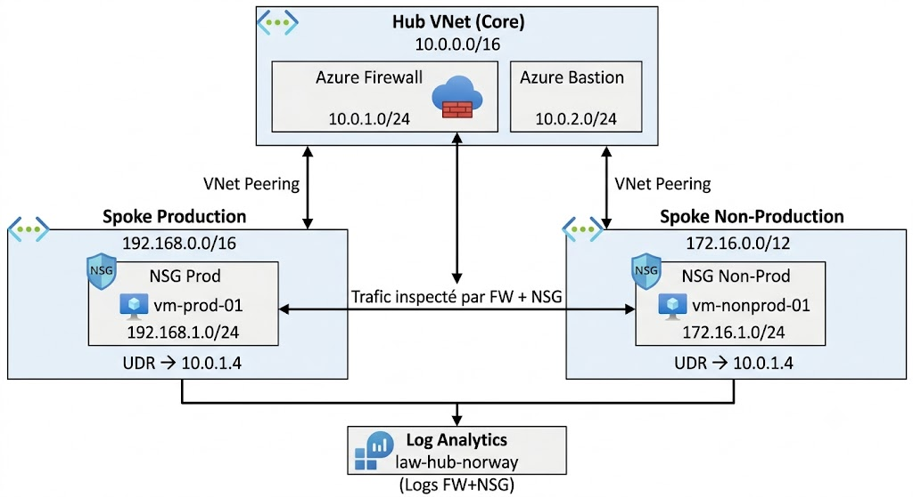

# AZ-NOR-SECURE-HUB-SPOKE

<div align="center">


**Architecture Hub-and-Spoke sécurisée avec inspection de flux centralisée**

*Version 2.1 - Terraform · NSG · Monitoring · CI/CD*

[Architecture](#-architecture) • [Composants](#-composants) • [Déploiement](#-déploiement) • [Sécurité](#-sécurité) • [CI/CD](#-cicd-github-actions)


</div>

---

## Table des matières

- [Vue d'ensemble](#-vue-densemble)
- [Avantages stratégiques](#-avantages-stratégiques)
- [Architecture](#-architecture)
- [Composants](#-composants)
- [Segmentation réseau](#-segmentation-réseau)
- [Structure du projet](#-structure-du-projet)
- [Code source Terraform](#-code-source-terraform)
  - [backend.tf](#-backendtf)
  - [locals.tf](#-localstf)
  - [main.tf](#-maintf)
  - [network.tf](#-networktf)
  - [nsg.tf](#-nsgtf)
  - [monitoring.tf](#-monitoringtf)
  - [variables.tf](#-variablestf)
  - [outputs.tf](#-outputstf)
  - [terraform.tfvars.modele](#-terraformtfvarsmodele)
- [Prérequis](#-prérequis)
- [Déploiement](#-déploiement)
- [CI/CD GitHub Actions](#-cicd-github-actions)
- [Sécurité](#-sécurité)
- [Monitoring](#-monitoring)
- [Bonnes pratiques Terraform](#-bonnes-pratiques-terraform)
- [Gestion des coûts — Compte Students](#-gestion-des-coûts--compte-students)
- [Dépannage](#-dépannage)
- [FAQ](#-faq)
- [Coûts estimés](#-coûts-estimés)
- [Évolutions futures](#-évolutions-futures)

---

## Vue d'ensemble

Ce projet implémente une architecture réseau **Hub-and-Spoke** sécurisée sur Microsoft Azure, déployée via **Terraform**, pour la région **Norway East**. L'architecture garantit une inspection centralisée de tout le trafic réseau via Azure Firewall, une segmentation claire entre les environnements de production et non-production, un monitoring complet avec alertes, et un pipeline CI/CD automatisé.

### Caractéristiques principales

-  **Inspection centralisée** : Tout le trafic passe par Azure Firewall
-  **Défense en profondeur** : Azure Firewall + NSG par subnet (double couche)
-  **Segmentation réseau** : Isolation complète Production / Non-Production
-  **Monitoring avancé** : Log Analytics + 5 alertes Azure Monitor avec notifications email
-  **Accès sécurisé** : Azure Bastion (aucune IP publique sur les VMs)
-  **Routage forcé** : UDR garantissant le passage par le Firewall
-  **Peering bidirectionnel** : Communication sécurisée Hub ↔ Spokes
-  **Infrastructure as Code** : 100% Terraform, reproductible en quelques commandes
-  **CI/CD** : Pipeline GitHub Actions (Validate → Checkov → Plan → Apply)
-  **Nommage centralisé** : `locals.tf` comme source unique de vérité

---

##  Avantages stratégiques

###  1. Défense en Profondeur (Double Couche de Sécurité)

Cette version 2.1 introduit une architecture de sécurité à **deux niveaux** :

- **Niveau 1 - Azure Firewall (L4/L7)** : Inspection et filtrage de tout le trafic inter-spoke avec journalisation complète.
- **Niveau 2 - NSG par subnet (L4)** : Filtrage réseau directement attaché à chaque subnet, indépendant du Firewall. Une ressource compromise ne peut pas contourner les deux couches.

###  2. Isolation Stricte des Environnements

- **Étanchéité** : Plages IP distinctes et VNets séparés empêchent tout mouvement latéral.
- **Standardisation** : Hub `10.0.x.x` · Prod `192.168.x.x` · Non-Prod `172.16.x.x`.

###  3. Monitoring Proactif avec Alertes

5 alertes Azure Monitor préconfigurées couvrent les scénarios critiques : volume de refus Firewall élevé (tentative d'intrusion), indisponibilité Firewall/Bastion, et surcharge CPU des VMs.

###  4. Auditabilité et Conformité

Logs NSG + Firewall centralisés dans Log Analytics. Prêt pour ISO 27001, RGPD, SOC 2.

###  5. DevOps & Maintenabilité

- **`locals.tf`** : Renommer toutes les ressources depuis un seul fichier.
- **`Makefile`** : `make plan`, `make apply`, `make vm-stop` pour les opérations quotidiennes.
- **CI/CD** : Chaque `git push` déclenche automatiquement validation + scan sécurité + plan.

###  Résumé des avantages

| Avantage | Impact Métier |
|----------|---------------|
| **Double couche sécurité** | Réduction drastique de la surface d'attaque |
| **Monitoring avec alertes** | Détection proactive des incidents en temps réel |
| **Nommage centralisé** | Maintenabilité et cohérence sur le long terme |
| **CI/CD automatisé** | Zéro déploiement manuel = moins d'erreurs humaines |
| **Reproductibilité** | Infrastructure identique en toutes régions en quelques commandes |

---

##  Architecture

### Topologie réseau



---

##  Composants

| Ressource | Nom | Détails |
|-----------|-----|---------|
| Hub VNet | `vnet-az-nor-hub-core` | `10.0.0.0/16` |
| Spoke Prod VNet | `vnet-az-nor-spoke-prod` | `192.168.0.0/16` |
| Spoke Non-Prod VNet | `vnet-az-nor-spoke-nonprod` | `172.16.0.0/12` |
| Azure Firewall | `fw-az-nor-hub-central` | Standard, IP privée `10.0.1.4` |
| Firewall Policy | `fw-policy-az-nor-global` | Règle Allow inter-spoke |
| Azure Bastion | `bastion-az-nor-hub` | Standard, accès SSH/RDP sécurisé |
| NSG Prod | `nsg-prod-resources` | Défense en profondeur L4 |
| NSG Non-Prod | `nsg-nonprod-resources` | Défense en profondeur L4 |
| Route Table UDR | `rt-az-nor-forced-to-firewall` | `0.0.0.0/0` → `10.0.1.4` |
| Log Analytics | `law-az-nor-hub-norway` | 30 jours, PerGB2018 |
| VM Production | `vm-prod-01` | Ubuntu 20.04, Standard_B1s |
| VM Non-Prod | `vm-nonprod-01` | Ubuntu 20.04, Standard_B1s |
| Action Group | `ag-az-nor-security-alerts` | Notifications email |

---

##  Segmentation réseau

| Environnement | Plage | Subnet ressources | NSG |
|--------------|-------|-------------------|-----|
| **Hub** | `10.0.0.0/16` | FW: `10.0.1.0/24` · Bastion: `10.0.2.0/24` | — |
| **Production** | `192.168.0.0/16` | `192.168.1.0/24` | ✅ `nsg-prod-resources` |
| **Non-Production** | `172.16.0.0/12` | `172.16.1.0/24` | ✅ `nsg-nonprod-resources` |

### Règles de sécurité

| Couche | Règle | Source | Destination | Action |
|--------|-------|--------|-------------|--------|
| **Firewall** | Allow-Spoke-to-Spoke | `192.168.0.0/16` `172.16.0.0/12` | `192.168.0.0/16` `172.16.0.0/12` | ✅ Allow |
| **NSG Prod** | Allow-SSH-From-Bastion | `10.0.2.0/24` | `192.168.1.0/24`:22 | ✅ Allow |
| **NSG Prod** | Deny-All-Inbound | `*` | `*` | 🔴 Deny |
| **NSG Non-Prod** | Allow-SSH-From-Bastion | `10.0.2.0/24` | `172.16.1.0/24`:22 | ✅ Allow |
| **NSG Non-Prod** | Allow-HTTP-HTTPS | `192.168.0.0/16` | `172.16.1.0/24`:80,443 | ✅ Allow |

---

##  Structure du projet

```
az-nor-secure-hub-spoke/
├── .github/
│   └── workflows/
│       └── terraform.yml       # Pipeline CI/CD GitHub Actions
├── backend.tf                  # Remote state + configuration provider avancée
├── locals.tf                   # Conventions de nommage centralisées
├── main.tf                     # Firewall, Bastion, VMs, UDR, Log Analytics
├── network.tf                  # VNets, Subnets, VNet Peerings
├── nsg.tf                      # Network Security Groups (défense en profondeur)
├── monitoring.tf               # Action Group + 5 alertes Azure Monitor
├── variables.tf                # Variables avec validations
├── outputs.tf                  # Sorties post-déploiement
├── terraform.tfvars.modele     # Modèle de configuration (à copier)
├── Makefile                    # Commandes simplifiées
├── CHANGELOG.md                # Historique des versions
├── .gitignore                  # Protection des fichiers sensibles
└── README.md                   # Ce fichier
```

---

##  Code source Terraform

###  `backend.tf`

Configuration du provider avec options avancées et backend distant sur Azure Storage.

```hcl
###############################################################################
# AZ-NOR-SECURE-HUB-SPOKE - backend.tf
###############################################################################

terraform {
  # backend "azurerm" {
  #   resource_group_name  = "rg-terraform-state-norway"
  #   storage_account_name = "sttfstatenorway001"
  #   container_name       = "tfstate"
  #   key                  = "hub-spoke/norway.terraform.tfstate"
  # }

  required_version = ">= 1.5.0"

  required_providers {
    azurerm = {
      source  = "hashicorp/azurerm"
      version = "~> 3.100"
    }
    random = {
      source  = "hashicorp/random"
      version = "~> 3.6"
    }
  }
}

provider "azurerm" {
  features {
    resource_group {
      prevent_deletion_if_contains_resources = true
    }
    virtual_machine {
      delete_os_disk_on_deletion = true
    }
  }
}
```

>  **Bootstrap backend** (une seule fois, avant `terraform init`) :
> ```bash
> az group create --name rg-terraform-state-norway --location norwayeast
> az storage account create --name sttfstatenorway001 \
>   --resource-group rg-terraform-state-norway --location norwayeast \
>   --sku Standard_LRS --allow-blob-public-access false
> az storage container create --name tfstate --account-name sttfstatenorway001
> ```

---

###  `locals.tf`

Source unique de vérité pour tous les noms de ressources. Modifier ici impacte automatiquement l'ensemble du projet.

```hcl
###############################################################################
# AZ-NOR-SECURE-HUB-SPOKE - locals.tf
###############################################################################

locals {
  prefix   = "az-nor"
  env_hub  = "hub"
  env_prod = "prod"
  env_dev  = "nonprod"

  # Nommage réseau
  vnet_hub_name     = "vnet-${local.prefix}-${local.env_hub}-core"
  vnet_prod_name    = "vnet-${local.prefix}-spoke-${local.env_prod}"
  vnet_nonprod_name = "vnet-${local.prefix}-spoke-${local.env_dev}"

  snet_fw_name      = "AzureFirewallSubnet"   # Imposé par Azure
  snet_bastion_name = "AzureBastionSubnet"    # Imposé par Azure
  snet_prod_name    = "snet-${local.env_prod}-resources"
  snet_nonprod_name = "snet-${local.env_dev}-resources"

  # Nommage sécurité
  firewall_name        = "fw-${local.prefix}-${local.env_hub}-central"
  firewall_policy_name = "fw-policy-${local.prefix}-global"
  bastion_name         = "bastion-${local.prefix}-${local.env_hub}"
  route_table_name     = "rt-${local.prefix}-forced-to-firewall"

  # IPs publiques
  pip_firewall_name = "pip-fw-${local.prefix}-${local.env_hub}"
  pip_bastion_name  = "pip-bastion-${local.prefix}-${local.env_hub}"

  # NSG
  nsg_prod_name    = "nsg-${local.env_prod}-resources"
  nsg_nonprod_name = "nsg-${local.env_dev}-resources"

  # VMs
  vm_prod_name     = "vm-${local.env_prod}-01"
  vm_nonprod_name  = "vm-${local.env_dev}-01"
  nic_prod_name    = "nic-vm-${local.env_prod}-01"
  nic_nonprod_name = "nic-vm-${local.env_dev}-01"

  # Monitoring
  law_name             = "law-${local.prefix}-${local.env_hub}-norway"
  action_group_name    = "ag-${local.prefix}-security-alerts"
  alert_fw_denial_name = "alert-fw-${local.prefix}-high-denials"
  alert_fw_health_name = "alert-fw-${local.prefix}-health"

  common_tags = merge(var.tags, {
    DeployedWith = "Terraform"
    LastUpdated  = timestamp()
  })
}
```

---

###  `main.tf`

Ressources principales : Firewall, Bastion, Log Analytics, UDR, Machines Virtuelles.

```hcl
###############################################################################
# AZ-NOR-SECURE-HUB-SPOKE - main.tf
###############################################################################

resource "azurerm_resource_group" "main" {
  name     = var.resource_group_name
  location = var.location
  tags     = var.tags
}

resource "azurerm_log_analytics_workspace" "main" {
  name                = local.law_name
  location            = azurerm_resource_group.main.location
  resource_group_name = azurerm_resource_group.main.name
  sku                 = "PerGB2018"
  retention_in_days   = var.log_retention_days
  tags                = var.tags
}

resource "azurerm_firewall_policy" "main" {
  name                = local.firewall_policy_name
  resource_group_name = azurerm_resource_group.main.name
  location            = azurerm_resource_group.main.location
  sku                 = "Standard"
  tags                = var.tags
}

resource "azurerm_firewall_policy_rule_collection_group" "main" {
  name               = "rcg-internal-traffic"
  firewall_policy_id = azurerm_firewall_policy.main.id
  priority           = 100

  network_rule_collection {
    name     = "Allow-Internal-Traffic"
    priority = 100
    action   = "Allow"

    rule {
      name                  = "Allow-Spoke-to-Spoke"
      protocols             = ["ICMP", "TCP", "UDP"]
      source_addresses      = [var.prod_address_space, var.nonprod_address_space]
      destination_addresses = [var.prod_address_space, var.nonprod_address_space]
      destination_ports     = ["*"]
    }
  }
}

resource "azurerm_public_ip" "firewall" {
  name                = local.pip_firewall_name
  resource_group_name = azurerm_resource_group.main.name
  location            = azurerm_resource_group.main.location
  allocation_method   = "Static"
  sku                 = "Standard"
  tags                = var.tags
}

resource "azurerm_firewall" "main" {
  name                = local.firewall_name
  resource_group_name = azurerm_resource_group.main.name
  location            = azurerm_resource_group.main.location
  sku_name            = "AZFW_VNet"
  sku_tier            = "Standard"
  firewall_policy_id  = azurerm_firewall_policy.main.id
  tags                = var.tags

  ip_configuration {
    name                 = "ipconfig-fw"
    subnet_id            = azurerm_subnet.firewall.id
    public_ip_address_id = azurerm_public_ip.firewall.id
  }
}

resource "azurerm_monitor_diagnostic_setting" "firewall" {
  name                       = "diag-fw-${local.prefix}"
  target_resource_id         = azurerm_firewall.main.id
  log_analytics_workspace_id = azurerm_log_analytics_workspace.main.id

  enabled_log { category = "AzureFirewallNetworkRule" }
  enabled_log { category = "AzureFirewallApplicationRule" }
  metric { category = "AllMetrics" }

  lifecycle {
    create_before_destroy = true   # évite le 409 si Terraform recrée le setting
  }
}

resource "azurerm_public_ip" "bastion" {
  name                = local.pip_bastion_name
  resource_group_name = azurerm_resource_group.main.name
  location            = azurerm_resource_group.main.location
  allocation_method   = "Static"
  sku                 = "Standard"
  tags                = var.tags
}

resource "azurerm_bastion_host" "main" {
  name                = local.bastion_name
  resource_group_name = azurerm_resource_group.main.name
  location            = azurerm_resource_group.main.location
  sku                 = "Standard"
  tags                = var.tags

  ip_configuration {
    name                 = "ipconfig-bastion"
    subnet_id            = azurerm_subnet.bastion.id
    public_ip_address_id = azurerm_public_ip.bastion.id
  }
}

resource "azurerm_route_table" "forced_firewall" {
  name                       = local.route_table_name
  resource_group_name        = azurerm_resource_group.main.name
  location                   = azurerm_resource_group.main.location
  bgp_route_propagation_enabled = false   # remplace disable_bgp_route_propagation
  tags                       = var.tags

  route {
    name                   = "route-to-firewall"
    address_prefix         = "0.0.0.0/0"
    next_hop_type          = "VirtualAppliance"
    next_hop_in_ip_address = var.firewall_private_ip
  }
}

resource "azurerm_subnet_route_table_association" "prod" {
  subnet_id      = azurerm_subnet.prod_resources.id
  route_table_id = azurerm_route_table.forced_firewall.id
}

resource "azurerm_subnet_route_table_association" "nonprod" {
  subnet_id      = azurerm_subnet.nonprod_resources.id
  route_table_id = azurerm_route_table.forced_firewall.id
}

resource "azurerm_network_interface" "prod" {
  name                = local.nic_prod_name
  resource_group_name = azurerm_resource_group.main.name
  location            = azurerm_resource_group.main.location
  tags                = var.tags

  ip_configuration {
    name                          = "ipconfig-prod"
    subnet_id                     = azurerm_subnet.prod_resources.id
    private_ip_address_allocation = "Dynamic"
  }
}

resource "azurerm_linux_virtual_machine" "prod" {
  name                            = local.vm_prod_name
  resource_group_name             = azurerm_resource_group.main.name
  location                        = azurerm_resource_group.main.location
  size                            = var.vm_size
  admin_username                  = var.admin_username
  admin_password                  = var.admin_password
  disable_password_authentication = false
  network_interface_ids           = [azurerm_network_interface.prod.id]
  tags                            = var.tags

  os_disk {
    caching              = "ReadWrite"
    storage_account_type = "Standard_LRS"
  }

  source_image_reference {
    publisher = "Canonical"
    offer     = "0001-com-ubuntu-server-focal"
    sku       = "20_04-lts"
    version   = "latest"
  }
}

resource "azurerm_network_interface" "nonprod" {
  name                = local.nic_nonprod_name
  resource_group_name = azurerm_resource_group.main.name
  location            = azurerm_resource_group.main.location
  tags                = var.tags

  ip_configuration {
    name                          = "ipconfig-nonprod"
    subnet_id                     = azurerm_subnet.nonprod_resources.id
    private_ip_address_allocation = "Dynamic"
  }
}

resource "azurerm_linux_virtual_machine" "nonprod" {
  name                            = local.vm_nonprod_name
  resource_group_name             = azurerm_resource_group.main.name
  location                        = azurerm_resource_group.main.location
  size                            = var.vm_size
  admin_username                  = var.admin_username
  admin_password                  = var.admin_password
  disable_password_authentication = false
  network_interface_ids           = [azurerm_network_interface.nonprod.id]
  tags                            = var.tags

  os_disk {
    caching              = "ReadWrite"
    storage_account_type = "Standard_LRS"
  }

  source_image_reference {
    publisher = "Canonical"
    offer     = "0001-com-ubuntu-server-focal"
    sku       = "20_04-lts"
    version   = "latest"
  }
}
```

---

###  `network.tf`

VNets, Subnets et 4 VNet Peerings bidirectionnels.

```hcl
###############################################################################
# AZ-NOR-SECURE-HUB-SPOKE - network.tf
###############################################################################

resource "azurerm_virtual_network" "hub" {
  name                = local.vnet_hub_name
  resource_group_name = azurerm_resource_group.main.name
  location            = azurerm_resource_group.main.location
  address_space       = [var.hub_address_space]
  tags                = var.tags
}

resource "azurerm_subnet" "firewall" {
  name                 = local.snet_fw_name      # "AzureFirewallSubnet" — NE PAS MODIFIER
  resource_group_name  = azurerm_resource_group.main.name
  virtual_network_name = azurerm_virtual_network.hub.name
  address_prefixes     = [var.hub_firewall_subnet]
}

resource "azurerm_subnet" "bastion" {
  name                 = local.snet_bastion_name  # "AzureBastionSubnet" — NE PAS MODIFIER
  resource_group_name  = azurerm_resource_group.main.name
  virtual_network_name = azurerm_virtual_network.hub.name
  address_prefixes     = [var.hub_bastion_subnet]
}

resource "azurerm_virtual_network" "prod" {
  name                = local.vnet_prod_name
  resource_group_name = azurerm_resource_group.main.name
  location            = azurerm_resource_group.main.location
  address_space       = [var.prod_address_space]
  tags                = var.tags
}

resource "azurerm_subnet" "prod_resources" {
  name                 = local.snet_prod_name
  resource_group_name  = azurerm_resource_group.main.name
  virtual_network_name = azurerm_virtual_network.prod.name
  address_prefixes     = [var.prod_subnet]
}

resource "azurerm_virtual_network" "nonprod" {
  name                = local.vnet_nonprod_name
  resource_group_name = azurerm_resource_group.main.name
  location            = azurerm_resource_group.main.location
  address_space       = [var.nonprod_address_space]
  tags                = var.tags
}

resource "azurerm_subnet" "nonprod_resources" {
  name                 = local.snet_nonprod_name
  resource_group_name  = azurerm_resource_group.main.name
  virtual_network_name = azurerm_virtual_network.nonprod.name
  address_prefixes     = [var.nonprod_subnet]
}

# Peerings Hub ↔ Prod
resource "azurerm_virtual_network_peering" "hub_to_prod" {
  name                         = "peer-hub-to-prod"
  resource_group_name          = azurerm_resource_group.main.name
  virtual_network_name         = azurerm_virtual_network.hub.name
  remote_virtual_network_id    = azurerm_virtual_network.prod.id
  allow_virtual_network_access = true
  allow_forwarded_traffic      = true
}

resource "azurerm_virtual_network_peering" "prod_to_hub" {
  name                         = "peer-prod-to-hub"
  resource_group_name          = azurerm_resource_group.main.name
  virtual_network_name         = azurerm_virtual_network.prod.name
  remote_virtual_network_id    = azurerm_virtual_network.hub.id
  allow_virtual_network_access = true
  allow_forwarded_traffic      = true
}

# Peerings Hub ↔ Non-Prod
resource "azurerm_virtual_network_peering" "hub_to_nonprod" {
  name                         = "peer-hub-to-nonprod"
  resource_group_name          = azurerm_resource_group.main.name
  virtual_network_name         = azurerm_virtual_network.hub.name
  remote_virtual_network_id    = azurerm_virtual_network.nonprod.id
  allow_virtual_network_access = true
  allow_forwarded_traffic      = true
}

resource "azurerm_virtual_network_peering" "nonprod_to_hub" {
  name                         = "peer-nonprod-to-hub"
  resource_group_name          = azurerm_resource_group.main.name
  virtual_network_name         = azurerm_virtual_network.nonprod.name
  remote_virtual_network_id    = azurerm_virtual_network.hub.id
  allow_virtual_network_access = true
  allow_forwarded_traffic      = true
}
```

---

###  `nsg.tf`

Network Security Groups - seconde couche de sécurité L4 sur chaque subnet applicatif.

```hcl
###############################################################################
# AZ-NOR-SECURE-HUB-SPOKE - nsg.tf
###############################################################################

resource "azurerm_network_security_group" "prod" {
  name                = local.nsg_prod_name
  resource_group_name = azurerm_resource_group.main.name
  location            = azurerm_resource_group.main.location
  tags                = var.tags

  security_rule {
    name                       = "Allow-SSH-From-Bastion"
    priority                   = 100
    direction                  = "Inbound"
    access                     = "Allow"
    protocol                   = "Tcp"
    source_port_range          = "*"
    destination_port_range     = "22"
    source_address_prefix      = var.hub_bastion_subnet
    destination_address_prefix = var.prod_subnet
  }

  security_rule {
    name                       = "Allow-Internal-From-Nonprod"
    priority                   = 110
    direction                  = "Inbound"
    access                     = "Allow"
    protocol                   = "*"
    source_port_range          = "*"
    destination_port_range     = "*"
    source_address_prefix      = var.nonprod_address_space
    destination_address_prefix = var.prod_subnet
  }

  security_rule {
    name                       = "Deny-All-Inbound"
    priority                   = 4096
    direction                  = "Inbound"
    access                     = "Deny"
    protocol                   = "*"
    source_port_range          = "*"
    destination_port_range     = "*"
    source_address_prefix      = "*"
    destination_address_prefix = "*"
  }

  security_rule {
    name                       = "Allow-Outbound-To-Nonprod"
    priority                   = 110
    direction                  = "Outbound"
    access                     = "Allow"
    protocol                   = "*"
    source_port_range          = "*"
    destination_port_range     = "*"
    source_address_prefix      = var.prod_subnet
    destination_address_prefix = var.nonprod_address_space
  }

  security_rule {
    name                       = "Deny-All-Outbound"
    priority                   = 4096
    direction                  = "Outbound"
    access                     = "Deny"
    protocol                   = "*"
    source_port_range          = "*"
    destination_port_range     = "*"
    source_address_prefix      = "*"
    destination_address_prefix = "*"
  }
}

resource "azurerm_subnet_network_security_group_association" "prod" {
  subnet_id                 = azurerm_subnet.prod_resources.id
  network_security_group_id = azurerm_network_security_group.prod.id
}

resource "azurerm_network_security_group" "nonprod" {
  name                = local.nsg_nonprod_name
  resource_group_name = azurerm_resource_group.main.name
  location            = azurerm_resource_group.main.location
  tags                = var.tags

  security_rule {
    name                       = "Allow-SSH-From-Bastion"
    priority                   = 100
    direction                  = "Inbound"
    access                     = "Allow"
    protocol                   = "Tcp"
    source_port_range          = "*"
    destination_port_range     = "22"
    source_address_prefix      = var.hub_bastion_subnet
    destination_address_prefix = var.nonprod_subnet
  }

  security_rule {
    name                       = "Allow-HTTP-HTTPS-Inbound"
    priority                   = 120
    direction                  = "Inbound"
    access                     = "Allow"
    protocol                   = "Tcp"
    source_port_range          = "*"
    destination_port_ranges    = ["80", "443"]
    source_address_prefix      = var.prod_address_space
    destination_address_prefix = var.nonprod_subnet
  }

  security_rule {
    name                       = "Deny-All-Inbound"
    priority                   = 4096
    direction                  = "Inbound"
    access                     = "Deny"
    protocol                   = "*"
    source_port_range          = "*"
    destination_port_range     = "*"
    source_address_prefix      = "*"
    destination_address_prefix = "*"
  }

  security_rule {
    name                       = "Deny-All-Outbound"
    priority                   = 4096
    direction                  = "Outbound"
    access                     = "Deny"
    protocol                   = "*"
    source_port_range          = "*"
    destination_port_range     = "*"
    source_address_prefix      = "*"
    destination_address_prefix = "*"
  }
}

resource "azurerm_subnet_network_security_group_association" "nonprod" {
  subnet_id                 = azurerm_subnet.nonprod_resources.id
  network_security_group_id = azurerm_network_security_group.nonprod.id
}

# Logs NSG → Log Analytics
resource "azurerm_monitor_diagnostic_setting" "nsg_prod" {
  name                       = "diag-nsg-prod"
  target_resource_id         = azurerm_network_security_group.prod.id
  log_analytics_workspace_id = azurerm_log_analytics_workspace.main.id

  enabled_log { category = "NetworkSecurityGroupEvent" }
  enabled_log { category = "NetworkSecurityGroupRuleCounter" }
}

resource "azurerm_monitor_diagnostic_setting" "nsg_nonprod" {
  name                       = "diag-nsg-nonprod"
  target_resource_id         = azurerm_network_security_group.nonprod.id
  log_analytics_workspace_id = azurerm_log_analytics_workspace.main.id

  enabled_log { category = "NetworkSecurityGroupEvent" }
  enabled_log { category = "NetworkSecurityGroupRuleCounter" }
}
```

---

###  `monitoring.tf`

Action Group email + 5 alertes Azure Monitor préconfigurées.

```hcl
###############################################################################
# AZ-NOR-SECURE-HUB-SPOKE - monitoring.tf
###############################################################################

resource "azurerm_monitor_action_group" "security" {
  name                = local.action_group_name
  resource_group_name = azurerm_resource_group.main.name
  short_name          = "sec-alerts"
  tags                = var.tags

  email_receiver {
    name                    = "admin-email"
    email_address           = var.alert_email
    use_common_alert_schema = true
  }
}

# Alerte 1 : Volume de refus Firewall élevé (tentative d'intrusion)
resource "azurerm_monitor_scheduled_query_rules_alert_v2" "fw_high_denials" {
  name                = local.alert_fw_denial_name
  resource_group_name = azurerm_resource_group.main.name
  location            = azurerm_resource_group.main.location
  tags                = var.tags
  evaluation_frequency = "PT5M"
  window_duration      = "PT5M"
  scopes               = [azurerm_log_analytics_workspace.main.id]
  severity             = 2
  enabled              = true
  description          = "Alerte si le Firewall refuse plus de ${var.fw_denial_threshold} connexions en 5 minutes"

  criteria {
    query = <<-QUERY
      AZFWNetworkRule
      | where Action == "Deny"
      | summarize DenialCount = count() by bin(TimeGenerated, 5m)
      | where DenialCount > ${var.fw_denial_threshold}
    QUERY
    time_aggregation_method = "Count"
    threshold               = 0
    operator                = "GreaterThan"
    failing_periods {
      minimum_failing_periods_to_trigger_alert = 1
      number_of_evaluation_periods             = 1
    }
  }

  action { action_groups = [azurerm_monitor_action_group.security.id] }
}

# Alerte 2 : Disponibilité Firewall < 95%
resource "azurerm_monitor_metric_alert" "fw_health" {
  name                = local.alert_fw_health_name
  resource_group_name = azurerm_resource_group.main.name
  scopes              = [azurerm_firewall.main.id]
  description         = "Disponibilité Firewall < 95%"
  severity            = 1
  frequency           = "PT1M"
  window_size         = "PT5M"
  tags                = var.tags

  criteria {
    metric_namespace = "Microsoft.Network/azureFirewalls"
    metric_name      = "FirewallHealth"
    aggregation      = "Average"
    operator         = "LessThan"
    threshold        = 95
  }

  action { action_group_id = azurerm_monitor_action_group.security.id }
}

# Alerte 3 : CPU VM Prod > 85%
resource "azurerm_monitor_metric_alert" "vm_prod_cpu" {
  name                = "alert-cpu-vm-prod"
  resource_group_name = azurerm_resource_group.main.name
  scopes              = [azurerm_linux_virtual_machine.prod.id]
  description         = "CPU vm-prod-01 > 85%"
  severity            = 2
  frequency           = "PT1M"
  window_size         = "PT5M"
  tags                = var.tags

  criteria {
    metric_namespace = "Microsoft.Compute/virtualMachines"
    metric_name      = "Percentage CPU"
    aggregation      = "Average"
    operator         = "GreaterThan"
    threshold        = 85
  }

  action { action_group_id = azurerm_monitor_action_group.security.id }
}

# Alerte 4 : CPU VM Non-Prod > 85%
resource "azurerm_monitor_metric_alert" "vm_nonprod_cpu" {
  name                = "alert-cpu-vm-nonprod"
  resource_group_name = azurerm_resource_group.main.name
  scopes              = [azurerm_linux_virtual_machine.nonprod.id]
  description         = "CPU vm-nonprod-01 > 85%"
  severity            = 2
  frequency           = "PT1M"
  window_size         = "PT5M"
  tags                = var.tags

  criteria {
    metric_namespace = "Microsoft.Compute/virtualMachines"
    metric_name      = "Percentage CPU"
    aggregation      = "Average"
    operator         = "GreaterThan"
    threshold        = 85
  }

  action { action_group_id = azurerm_monitor_action_group.security.id }
}
```

---

###  `variables.tf`

Variables typées avec validations intégrées.

```hcl
###############################################################################
# AZ-NOR-SECURE-HUB-SPOKE - variables.tf
###############################################################################

variable "resource_group_name" {
  type    = string
  default = "RG-ARCHITECTURE-COMPLET-NORWAY"
}

variable "location" {
  type    = string
  default = "norwayeast"
}

variable "tags" {
  type = map(string)
  default = {
    Project     = "AZ-NOR-SECURE-HUB-SPOKE"
    Environment = "HubSpoke"
    ManagedBy   = "Terraform"
    Region      = "NorwayEast"
    Version     = "2.1"
  }
}

variable "hub_address_space" {
  type    = string
  default = "10.0.0.0/16"
}

variable "hub_firewall_subnet" {
  type    = string
  default = "10.0.1.0/24"
}

variable "hub_bastion_subnet" {
  type    = string
  default = "10.0.2.0/24"
}

variable "prod_address_space" {
  type    = string
  default = "192.168.0.0/16"
}

variable "prod_subnet" {
  type    = string
  default = "192.168.1.0/24"
}

variable "nonprod_address_space" {
  type    = string
  default = "172.16.0.0/12"
}

variable "nonprod_subnet" {
  type    = string
  default = "172.16.1.0/24"
}

variable "firewall_private_ip" {
  type    = string
  default = "10.0.1.4"
}

variable "vm_size" {
  type    = string
  default = "Standard_B1s"
  validation {
    condition     = contains(["Standard_B1s", "Standard_B1ms", "Standard_B2s", "Standard_D2s_v3"], var.vm_size)
    error_message = "Taille de VM non autorisée."
  }
}

variable "admin_username" {
  type    = string
  default = "azureadmin"
}

variable "admin_password" {
  type      = string
  sensitive = true
  validation {
    condition     = length(var.admin_password) >= 12
    error_message = "Le mot de passe doit avoir au moins 12 caractères."
  }
}

variable "alert_email" {
  type    = string
  default = "admin@example.com"
  validation {
    condition     = can(regex("^[a-zA-Z0-9._%+-]+@[a-zA-Z0-9.-]+\\.[a-zA-Z]{2,}$", var.alert_email))
    error_message = "Email invalide."
  }
}

variable "fw_denial_threshold" {
  type    = number
  default = 100
}

variable "log_retention_days" {
  type    = number
  default = 30
  validation {
    condition     = contains([30, 60, 90, 120, 180, 365], var.log_retention_days)
    error_message = "Rétention doit être : 30, 60, 90, 120, 180 ou 365 jours."
  }
}
```

---

###  `outputs.tf`

```hcl
###############################################################################
# AZ-NOR-SECURE-HUB-SPOKE - outputs.tf
###############################################################################

output "resource_group_name"         { value = azurerm_resource_group.main.name }
output "hub_vnet_id"                 { value = azurerm_virtual_network.hub.id }
output "prod_vnet_id"                { value = azurerm_virtual_network.prod.id }
output "nonprod_vnet_id"             { value = azurerm_virtual_network.nonprod.id }
output "firewall_private_ip"         { value = azurerm_firewall.main.ip_configuration[0].private_ip_address }
output "firewall_public_ip"          { value = azurerm_public_ip.firewall.ip_address }
output "bastion_public_ip"           { value = azurerm_public_ip.bastion.ip_address }
output "vm_prod_private_ip"          { value = azurerm_network_interface.prod.private_ip_address }
output "vm_nonprod_private_ip"       { value = azurerm_network_interface.nonprod.private_ip_address }
output "nsg_prod_id"                 { value = azurerm_network_security_group.prod.id }
output "nsg_nonprod_id"              { value = azurerm_network_security_group.nonprod.id }
output "log_analytics_workspace_id"  { value = azurerm_log_analytics_workspace.main.id }
output "log_analytics_workspace_key" { value = azurerm_log_analytics_workspace.main.primary_shared_key; sensitive = true }
```

---

###  `terraform.tfvars.modele`

```hcl
resource_group_name   = "RG-ARCHITECTURE-COMPLET-NORWAY"
location              = "norwayeast"
admin_password        = "VotreMotDePasseComplex2026!"
vm_size               = "Standard_B1s"
admin_username        = "azureadmin"
alert_email           = "votre.email@domaine.com"
fw_denial_threshold   = 100
log_retention_days    = 30

hub_address_space     = "10.0.0.0/16"
hub_firewall_subnet   = "10.0.1.0/24"
hub_bastion_subnet    = "10.0.2.0/24"
prod_address_space    = "192.168.0.0/16"
prod_subnet           = "192.168.1.0/24"
nonprod_address_space = "172.16.0.0/12"
nonprod_subnet        = "172.16.1.0/24"
firewall_private_ip   = "10.0.1.4"

tags = {
  Project     = "AZ-NOR-SECURE-HUB-SPOKE"
  Environment = "HubSpoke"
  ManagedBy   = "Terraform"
  Region      = "NorwayEast"
  CostCenter  = "INFRA-001"
}
```

---

##  Prérequis

-  [Terraform](https://developer.hashicorp.com/terraform/install) ≥ 1.5.0
-  [Azure CLI](https://learn.microsoft.com/cli/azure/install-azure-cli) ≥ 2.50.0
-  [Make](https://www.gnu.org/software/make/) (optionnel mais recommandé)
-  [Checkov](https://www.checkov.io/) (`pip install checkov`) pour les scans sécurité
-  Abonnement Azure actif (Students ou payant)
-  Permissions Contributor ou Owner

---

##  Déploiement

### Méthode rapide avec Make

```bash
# 1. Cloner le projet
git clone https://github.com/dspitech/AZ-NOR-SECURE-HUB-SPOKE-PRO.git
cd AZ-NOR-SECURE-HUB-SPOKE-PRO

# 2. Configurer les variables
cp terraform.tfvars.modele terraform.tfvars
nano terraform.tfvars   # Renseigner admin_password et alert_email

# 3. Déployer en 3 commandes
make init
make plan
make apply
```

### Méthode détaillée

**Étape 1 - Authentification**
```bash
az login
az account set --subscription "<NOM_OU_ID_ABONNEMENT>"
az account show
```

**Étape 2 - (Optionnel) Bootstrap du backend distant**
```bash
make bootstrap-backend
# Puis décommenter le bloc backend dans backend.tf
```

**Étape 3 - Initialisation**
```bash
make init
# ou : terraform init -upgrade
```

**Étape 4 - Scan sécurité**
```bash
make security-scan
# ou : checkov -d . --framework terraform --soft-fail
```

**Étape 5 - Plan**
```bash
make plan
# ou : terraform plan -var-file=terraform.tfvars -out=tfplan
```

**Étape 6 - Déploiement** (~15-20 minutes)
```bash
make apply
# ou : terraform apply tfplan
```

**Étape 7 - Vérification**
```bash
make output

## installer l'extension Network Watcher sur les deux VMs
# Installer sur vm-prod-01
az vm extension set `
  --resource-group RG-ARCHITECTURE-COMPLET-NORWAY `
  --vm-name vm-prod-01 `
  --name NetworkWatcherAgentLinux `
  --publisher Microsoft.Azure.NetworkWatcher `
  --version 1.4

# Installer sur vm-nonprod-01
az vm extension set `
  --resource-group RG-ARCHITECTURE-COMPLET-NORWAY `
  --vm-name vm-nonprod-01 `
  --name NetworkWatcherAgentLinux `
  --publisher Microsoft.Azure.NetworkWatcher `
  --version 1.4


# Test connectivité inter-Spoke
az network watcher test-connectivity --resource-group RG-ARCHITECTURE-COMPLET-NORWAY --source-resource vm-prod-01 --dest-resource vm-nonprod-01 --dest-port 22
```

**Destruction**
```bash
make destroy   # Demande confirmation "destroy"
```

---

##  CI/CD GitHub Actions

Le pipeline `.github/workflows/terraform.yml` s'exécute automatiquement à chaque `push` ou `pull_request` sur `main`.

### Workflow

```
Push/PR
  │
  ├──  validate     → terraform fmt + init + validate
  │                     + commentaire automatique sur la PR
  │
  ├──  security     → Checkov scan + upload SARIF vers GitHub Security
  │
  ├──  plan         → terraform plan + upload artefact
  │                     + résumé en commentaire PR
  │
  └──  apply        → terraform apply (après approbation manuelle)
      (main seulement)    Environnement GitHub "production" requis
```

### Configuration requise

C'est la configuration nécessaire pour que le pipeline GitHub Actions puisse se connecter à Azure et déployer l'infrastructure automatiquement.

---

## Étape 1 - Récupérer le Subscription ID automatiquement

```bash
# Récupérer le Subscription ID en PowerShell
$SUBSCRIPTION_ID = az account show --query id -o tsv
Write-Host "Subscription ID : $SUBSCRIPTION_ID"
```

---

## Étape 2 - Créer le Service Principal

```bash
# Création avec le Subscription ID récupéré automatiquement
az ad sp create-for-rbac `
  --name "sp-terraform-hub-spoke" `
  --role Contributor `
  --scopes /subscriptions/$SUBSCRIPTION_ID `
  --output json
```

>  Tu obtiens un JSON - **note bien ces 3 valeurs, elles n'apparaissent qu'une seule fois** :

```json
{
  "appId":    "aaa-bbb-ccc",
  "password": "xxx-yyy-zzz",
  "tenant":   "111-222-333"
}
```

| Clé JSON | Secret GitHub |
|----------|--------------|
| `appId` | `ARM_CLIENT_ID` |
| `password` | `ARM_CLIENT_SECRET` |
| `tenant` | `ARM_TENANT_ID` |

---

## Étape 3 - Vérifier que le SP est bien créé

```bash
az ad sp show --id $(az ad sp list --display-name "sp-terraform-hub-spoke" --query "[0].appId" -o tsv)
```

---

## Étape 4 - Ajouter les secrets dans GitHub

Va sur ton repo GitHub :

```
Settings → Secrets and variables → Actions → New repository secret
```

Ajoute ces 6 secrets un par un :

| Secret | Où le trouver |
|--------|--------------|
| `ARM_CLIENT_ID` | `appId` du JSON |
| `ARM_CLIENT_SECRET` | `password` du JSON |
| `ARM_TENANT_ID` | `tenant` du JSON |
| `ARM_SUBSCRIPTION_ID` | résultat de la commande ci-dessous |
| `TF_VAR_admin_password` | ton mot de passe VM (ex: `MonPass2026!`) |
| `ALERT_EMAIL` | ton email pour les alertes |

```bash
# Pour ARM_SUBSCRIPTION_ID
az account show --query id -o tsv
```

---

## Étape 5 - Créer l'environnement "production" dans GitHub

```
Settings → Environments → New environment → Nommer : production
```

Puis dans cet environnement :

```
Environment protection rules
  →  Required reviewers
  → Ajouter ton nom GitHub
  → Save protection rules
```

---

## Étape 6 - Vérifier que tout fonctionne

```bash
# Tester l'authentification du SP manuellement
az login \
  --service-principal \
  --username $ARM_CLIENT_ID \
  --password $ARM_CLIENT_SECRET \
  --tenant $ARM_TENANT_ID

# Vérifier les permissions
az role assignment list \
  --assignee $ARM_CLIENT_ID \
  --output table
```

---

## Étape 7 - Déclencher le pipeline

```bash
git add .
git commit -m "ci: configuration GitHub Actions"
git push origin main
```

Puis sur GitHub :

```
Actions → Terraform CI/CD → job Apply → Review deployments → Approve
```

---

## Résumé du flux complet

```
az login (local)
    │
    ▼
SUBSCRIPTION_ID=$(az account show --query id -o tsv)
    │
    ▼
az ad sp create-for-rbac → JSON (appId / password / tenant)
    │
    ▼
GitHub Secrets (6 secrets)
    │
    ▼
GitHub Environment "production" + approbation manuelle
    │
    ▼
git push → pipeline déclenché → Apply après approbation 
```

---

##  Sécurité

### Architecture de défense en profondeur

```
Internet
    │
    ▼
Azure Firewall (L4/L7)          ← Couche 1 : inspection + journalisation
    │
    ▼
UDR (routage forcé)             ← Couche 2 : impossible de contourner le FW
    │
    ▼
NSG par subnet (L4)             ← Couche 3 : filtrage granulaire + Deny-All par défaut
    │
    ▼
VM (aucune IP publique)         ← Couche 4 : surface d'attaque minimale
    │
    ▼
Azure Bastion (accès SSL)       ← Couche 5 : accès admin sécurisé uniquement
```

### Recommandations supplémentaires

- Utiliser **Azure Key Vault** pour stocker `admin_password`
- Activer **Azure Defender for Servers** pour la détection d'intrusion
- Configurer **Just-in-Time (JIT) VM Access** pour réduire la fenêtre d'exposition

---

##  Monitoring

### Alertes préconfigurées

| Alerte | Déclencheur | Sévérité |
|--------|-------------|----------|
| `alert-fw-high-denials` | > 100 refus Firewall en 5 min | ⚠️ Warning |
| `alert-fw-health` | Disponibilité Firewall < 95% | 🔴 Error |
| `alert-cpu-vm-prod` | CPU vm-prod-01 > 85% | ⚠️ Warning |
| `alert-cpu-vm-nonprod` | CPU vm-nonprod-01 > 85% | ⚠️ Warning |

### Requêtes KQL utiles

```kusto
// Trafic bloqué par le Firewall (dernières 24h)
AzureDiagnostics
| where Category == "AzureFirewallNetworkRule"
| where msg_s contains "Deny"
| where TimeGenerated > ago(24h)
| project TimeGenerated, srcIp_s, destIp_s, msg_s
| order by TimeGenerated desc

// Top 10 des sources de trafic bloqué
AzureDiagnostics
| where Category == "AzureFirewallNetworkRule"
| where msg_s contains "Deny"
| summarize count() by srcIp_s
| top 10 by count_ desc

// Événements NSG — règles déclenchées
AzureDiagnostics
| where Category == "NetworkSecurityGroupRuleCounter"
| summarize count() by ruleName_s, direction_s
| order by count_ desc
```

---

##  Bonnes pratiques Terraform

### Commandes Make disponibles

```bash
make help           # Liste toutes les commandes disponibles
make init           # terraform init
make validate       # terraform validate
make lint           # terraform fmt -recursive
make security-scan  # checkov scan
make plan           # terraform plan -out=tfplan
make apply          # terraform apply tfplan
make output         # terraform output
make vm-stop        # Arrêt des VMs (économie crédits)
make vm-start       # Démarrage des VMs
make costs          # Résumé des ressources facturables
make clean          # Suppression des fichiers temporaires
make destroy        # Destruction totale (confirmation requise)
```

### Gestion du tfstate

- Backend distant recommandé dès le travail en équipe
- Ne jamais committer `terraform.tfstate` ni `terraform.tfvars`
- Utiliser `TF_VAR_admin_password` en variable d'environnement en CI/CD

---

##  Gestion des coûts — Compte Students

>  **Important** : Le crédit Azure Students est d'environ **$100**. Azure Firewall Standard coûte **~$41/jour**. Sans gestion active, le crédit s'épuise en ~2-3 jours.

### Stratégie recommandée pour les Students

| Ressource | Coût/jour | Action recommandée |
|-----------|-----------|-------------------|
| Azure Firewall Standard | ~$41 | `make fw-stop` quand non utilisé |
| Azure Bastion Standard | ~$4.70 | Déployer uniquement pour les tests |
| VMs x2 Standard_B1s | ~$0.50 | `make vm-stop` la nuit |
| Log Analytics | ~$0.08/Go | Rétention 30j (valeur par défaut) |

### Commandes d'économie

```bash
# Arrêter les VMs quand vous ne travaillez pas (~$0.50/jour économisé)
make vm-stop

# Vérifier les ressources actives et leurs coûts estimés
make costs

# Supprimer toute l'infra après les tests (économise $41/jour)
make destroy
```

### Option : Firewall Basic (pour les Students)

Pour réduire les coûts à ~$300/mois au lieu de $1,250, remplacez dans `main.tf` :
```hcl
# Remplacer "Standard" par "Basic" dans azurerm_firewall et azurerm_firewall_policy
sku_tier = "Basic"
```
>  Le tier Basic ne supporte pas les règles Application Layer (L7). Adapté pour les tests, pas pour la production.

---

##  Dépannage

###  Les VMs ne communiquent pas

```bash
# 1. Vérifier les peerings
az network vnet peering list \
  --resource-group RG-ARCHITECTURE-COMPLET-NORWAY \
  --vnet-name vnet-az-nor-hub-core --output table

# 2. Vérifier les routes effectives
az network nic show-effective-route-table \
  --resource-group RG-ARCHITECTURE-COMPLET-NORWAY \
  --name nic-vm-prod-01 --output table

# 3. Vérifier l'état du Firewall
az network firewall show \
  --resource-group RG-ARCHITECTURE-COMPLET-NORWAY \
  --name fw-az-nor-hub-central \
  --query "provisioningState"
```

###  NSG bloque le trafic attendu

```bash
# Vérifier les règles NSG effectives sur la NIC
az network nic list-effective-nsg \
  --resource-group RG-ARCHITECTURE-COMPLET-NORWAY \
  --name nic-vm-prod-01 \
  --output table
```

###  Quota insuffisant (compte Students)

```bash
make fw-stop   # Libère le quota Firewall
# Ou : terraform destroy pour tout libérer
```

###  Erreur `timestamp()` dans locals.tf

La fonction `timestamp()` dans les tags génère un plan différent à chaque exécution. Si cela pose problème :
```hcl
# Remplacer dans locals.tf
LastUpdated = timestamp()
# Par :
LastUpdated = "2026-06-14"
```

---

##  FAQ

**Q : Comment ajouter un troisième Spoke (ex : Marketing) ?**

Dans `network.tf` : nouveau VNet + subnet + 2 peerings. Dans `main.tf` : association UDR. Dans `nsg.tf` : nouveau NSG. Dans `variables.tf` : nouvelles variables IP. Puis `make plan && make apply`.

**Q : Puis-je déployer dans une autre région ?**

Oui, modifiez `location` dans `terraform.tfvars`. Ajustez aussi le nom du Storage Account backend (doit être unique globalement).

**Q : Comment migrer depuis la version Bicep ?**

Utilisez `terraform import` ressource par ressource pour rattacher les ressources existantes au state Terraform, ou détruisez et redéployez en Terraform.

**Q : Le compte Students peut-il déployer toute l'architecture ?**

Oui, mais le crédit s'épuise vite. Utilisez `make vm-stop` et `make destroy` systématiquement après les tests. Envisagez le tier Firewall Basic pour économiser ~$950/mois.

---

##  Coûts estimés

| Ressource | SKU | Coût/mois (USD) | Coût/jour |
|-----------|-----|-----------------|-----------|
| Azure Firewall | Standard | ~$1,250 | ~$41 |
| Azure Bastion | Standard | ~$140 | ~$4.70 |
| Log Analytics | PerGB2018 | ~$2.30/Go | - |
| VMs (x2) | Standard_B1s | ~$15 | ~$0.50 |
| VNets + Peerings | - | Gratuit | - |
| Storage (tfstate) | LRS | ~$0.05 | - |

**Total estimé** : ~$1,405–1,500/mois hors trafic

>  [Calculateur de prix Azure](https://azure.microsoft.com/pricing/calculator/)

---

##  Évolutions futures

### Version 2.2 (Planifiée)
- [ ] Module Terraform réutilisable pour les Spokes (`modules/spoke/`)
- [ ] Support multi-régions avec global peering
- [ ] Azure DDoS Protection Standard
- [ ] Private Endpoints pour les services Azure PaaS
- [ ] Auto-shutdown des VMs via Azure Automation (économie Students)

### Version 3.0 (Future)
- [ ] ExpressRoute pour connectivité hybride on-premise
- [ ] Azure WAF (Web Application Firewall)
- [ ] Azure Sentinel (SIEM) pour la détection avancée
- [ ] Dashboard Azure Monitor personnalisé

---

##  Ressources

- [Documentation Terraform azurerm](https://registry.terraform.io/providers/hashicorp/azurerm/latest/docs)
- [Architecture Hub-and-Spoke Azure](https://docs.microsoft.com/azure/architecture/reference-architectures/hybrid-networking/hub-spoke)
- [Azure Firewall](https://docs.microsoft.com/azure/firewall/)
- [NSG Azure](https://docs.microsoft.com/azure/virtual-network/network-security-groups-overview)
- [Azure Bastion](https://docs.microsoft.com/azure/bastion/)
- [Checkov - IaC Security Scanner](https://www.checkov.io/)

---

##  Licence

Ce projet est entièrement libre et open source, mis à disposition gratuitement.

---

[⬆ Retour en haut](#-az-nor-secure-hub-spoke)
